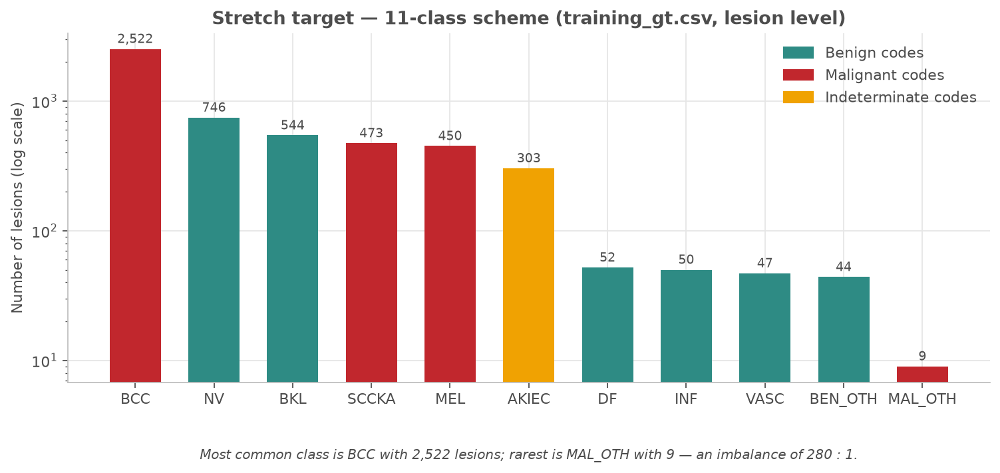
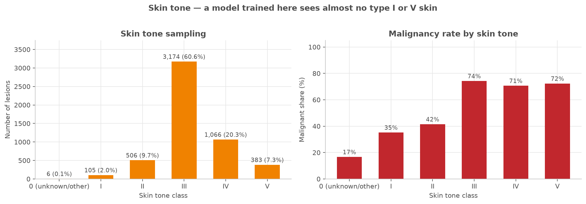
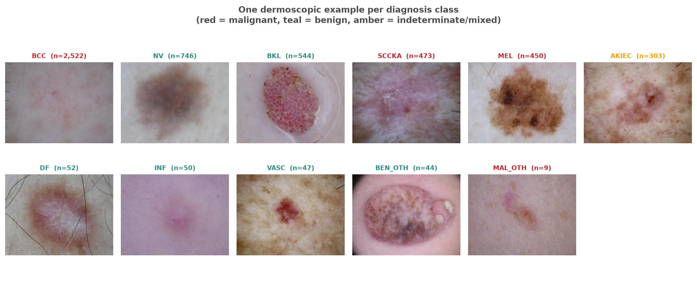
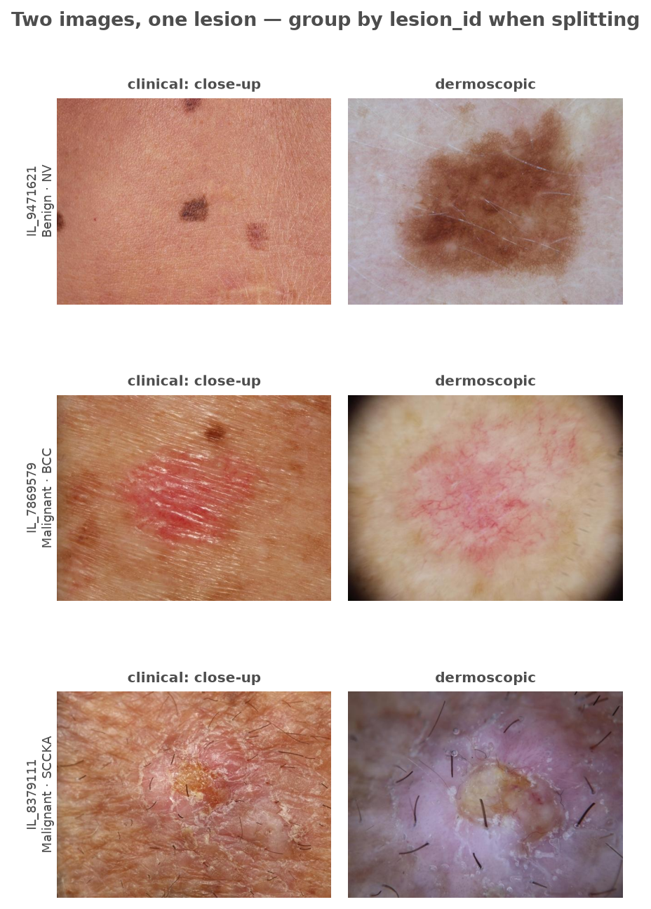

# MILK10k — Computer Vision Course Project

**Computer Vision and Speech Recognition · EADA Business School**
Individual course project — skin lesion classification on the real
[MILK10k](https://api.isic-archive.com/doi/milk10k/) dataset.

This repository holds my work for the course. **Session 1** is the exploratory data
analysis: understanding the dataset before writing a single line of modelling code.

---

## The clinical task in one paragraph

MILK10k contains **10,480 dermatological images of 5,240 skin lesions**, each photographed
twice — once through a **dermatoscope** and once as a **clinical close-up**. Nearly all
lesions were biopsied, so the labels come from histopathology rather than opinion. The task
is to classify a lesion as **Benign / Malignant / Indeterminate** (`diagnosis_1`), with a
finer 11-class diagnosis as a stretch goal. The purpose is **triage**: skin cancer is highly
curable when caught early and dangerous when missed, so the metric that matters is
**sensitivity on malignant lesions**, not accuracy. A model trained here answers a narrow
question — *"given that a dermatologist was already worried enough to biopsy this lesion, is
it cancer?"* — because the dataset is 69% malignant by referral bias, not by nature.

📄 **Full write-up: [`docs/clinical_task.md`](docs/clinical_task.md)**

---

## Session 1 deliverable — the EDA

| What | Where |
|---|---|
| **EDA notebook** (executed, with all outputs) | [`notebooks/01_eda_milk10k.ipynb`](notebooks/01_eda_milk10k.ipynb) |
| Written summary with every number | [`reports/eda_summary.md`](reports/eda_summary.md) |
| 15 figures | [`reports/figures/`](reports/figures/) |
| Summary tables (CSV) | [`reports/tables/`](reports/tables/) |
| Clinical task explanation | [`docs/clinical_task.md`](docs/clinical_task.md) |

### Nine findings that change the pipeline

| # | Finding | Consequence |
|---|---|---|
| 1 | Every lesion has **exactly 2 images** (verified, 5,240/5,240) | Split on `lesion_id`. A random row split leaks every single lesion across train/test. |
| 2 | **69.4% of lesions are Malignant** | A constant "Malignant" prediction scores 69.4% accuracy. Report balanced accuracy, macro-F1 and malignant recall instead. |
| 3 | 11-class imbalance is **280:1** (BCC 2,522 vs MAL_OTH 9) | Class weighting, oversampling, or merge the rare tail. |
| 4 | Dermoscopic and clinical images have **different pixel statistics** | Two modalities, not two samples. Stratify or condition on `image_type`. |
| 5 | **AKIEC straddles** Indeterminate (123) and Malignant (180) | The 3-class target is *not* derivable from the 11-class code by lookup. |
| 6 | `anatom_site_general` missing 37%, `melanocytic` missing 77% | Metadata needs an explicit "unknown" category, not mode imputation. |
| 7 | **61% of lesions are one skin tone class** (III) | Report per-skin-tone recall or group failures stay invisible. |
| 8 | Images vary in resolution | A resize/crop step is mandatory before batching. |
| 9 | Dataset is **biopsy-referred**, not population-representative | Any performance claim must state the population it applies to. |

### A few of the figures

| | |
|---|---|
|  |  |
|  |  |

---

## Project structure

```
Computer_Vision/
├── README.md                        # This file
├── requirements.txt
├── .gitignore                       # Excludes data/ (345 MB) and .venv/
│
├── data/                            # Dataset (NOT committed — see data/README.md)
│   └── milk10k/
│       ├── metadata.csv             # 10,480 rows — one per image
│       ├── images/                  # 10,480 JPEGs
│       └── supplements/
│           ├── training_gt.csv      # 5,240 rows — one per lesion, 11-class one-hot
│           ├── training_input.csv   # MONET concept scores, skin tone, body site
│           └── training_supp.csv    # Full-text diagnosis
│
├── src/milk10k/                     # Reusable package — imported by notebooks & scripts
│   ├── __init__.py
│   ├── config.py                    # Paths, label schemes, plotting style
│   ├── data.py                      # Loading, joining, integrity checks, image stats
│   └── plots.py                     # Every figure in the report
│
├── notebooks/
│   └── 01_eda_milk10k.ipynb         # Session 1 — the EDA, executed with outputs
│
├── scripts/
│   ├── download_data.sh             # Fetch + unzip the dataset
│   ├── run_eda.py                   # Regenerate all figures/tables headlessly
│   └── build_notebook.py            # Generate the notebook from source
│
├── docs/
│   └── clinical_task.md             # What we are solving and why
│
└── reports/
    ├── eda_summary.md               # Generated numeric summary
    ├── figures/                     # 15 PNGs
    └── tables/                      # Summary CSVs
```

The design rule: **analysis logic lives in `src/milk10k/`, not in notebook cells.** Later
sessions import the same loaders and the same split logic, so the project stays consistent
as it grows.

---

## Reproducing this

```bash
# 1. Clone and enter
git clone https://github.com/stansilaisijfrnep/milk10k-computer-vision.git
cd milk10k-computer-vision

# 2. Environment
python3 -m venv .venv && source .venv/bin/activate
pip install -r requirements.txt

# 3. Data (~345 MB, CC-BY-NC — not committed)
bash scripts/download_data.sh

# 4a. Regenerate every figure and table headlessly
python scripts/run_eda.py

# 4b. ...or work through the notebook
jupyter lab notebooks/01_eda_milk10k.ipynb
```

**Environment used:** Python 3.14, pandas 3.0, numpy 2.5, matplotlib, Pillow.
**Editor:** Visual Studio Code.

---

## Course roadmap

- [x] **Session 1** — EDA, project structure, clinical task definition
- [ ] Session 2 — Image representation, sampling, normalisation
- [ ] Session 3+ — Baselines, CNNs, transfer learning, evaluation, deployment
- [ ] Final — Working shareable application + MILK10k leaderboard submission

---

## Data licence and attribution

MILK10k is published by the MILK study team via the ISIC Archive under **CC BY-NC**.
The dataset is *not* redistributed in this repository — `scripts/download_data.sh` fetches
it from the official source.

- Dataset: <https://api.isic-archive.com/doi/milk10k/>
- Description paper: <https://doi.org/10.1016/j.jid.2025.06.1594>
