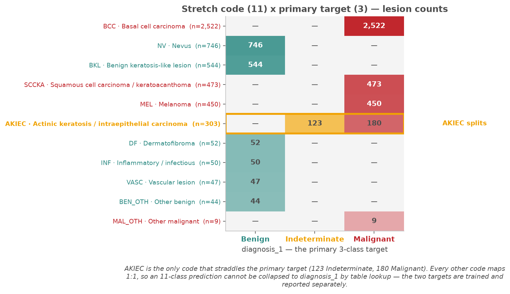
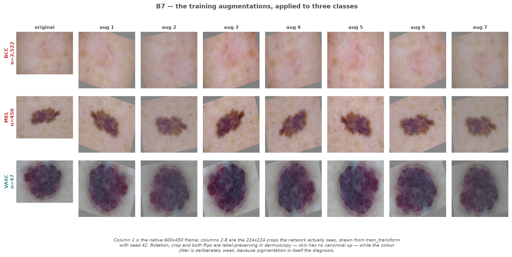

# Milestone 1 — MILK10k data pipeline

Stanislaus Lattorff · splits created 2026-09-22 · seed 42 · **no model has been trained**; every number below describes the data or the pipeline.

MILK10k: 10,480 images = 5,240 lesions x 2 (one dermoscopic, one clinical close-up). Detail lives in [label_strategy.md](../docs/label_strategy.md), [preprocessing_decisions.md](../docs/preprocessing_decisions.md), [data_quality_report.md](data_quality_report.md) and [findings_check.md](findings_check.md).

## 1. Label strategy

**Primary target: `diagnosis_1`, all three classes kept** — Malignant 3,634 (69.4%), Benign 1,483 (28.3%), Indeterminate 123 (2.3%) lesions. Indeterminate means the pathologist could not rule malignancy out; merging it into Benign would teach the model to reassure on exactly the lesions nobody was reassured about, and dropping it narrows the task to the easy cases. **Stretch target: all 11 codes kept.** Merging the rare tail into "other" would put malignant MAL_OTH in one bucket with benign VASC, DF, INF and BEN_OTH and hide the one error that matters.

**The two schemes are not interchangeable.** AKIEC is the only code that straddles `diagnosis_1`: 123 Indeterminate + 180 Malignant. All 123 Indeterminate lesions are AKIEC; every other code maps 1:1. AKIEC spans actinic keratosis to carcinoma *in situ*, where the pathologist's call is a judgement, not a lookup. So `diagnosis_1` cannot be derived from an 11-class prediction; both are stored side by side and treated as separate targets ([label_map.json](../artifacts/label_map.json)).

## 2. Split design and verification

Lesions (not images) are split 70/15/15 with `StratifiedGroupKFold`, grouped on `lesion_id`, stratified on the 11-class `dx`, seed 42. A naive image-level split put 89% of test lesions into train; grouping makes that impossible. Checked by `splits.verify_splits` and re-computed from the committed CSVs:

| check | result |
|---|---|
| lesions train / val / test | 3,667 / 786 / 787 (70.0 / 15.0 / 15.0%) |
| images train / val / test | 7,334 / 1,572 / 1,574 |
| pairwise lesion overlap (train-val, train-test, val-test) | 0 / 0 / 0 |
| every lesion has exactly 2 images in its own split | yes, all three splits |
| max class-proportion deviation from global, `dx` | 0.14 pp (`diagnosis_1`: 0.19 pp) |
| MAL_OTH lesions train / val / test | 7 / 1 / 1 |

## 3. Class imbalance (measured on TRAIN)

Full distribution for both schemes, including the log-scale 11-class panel: [b2_class_distribution.png](figures/milestone1/b2_class_distribution.png).

| scheme | train counts (lesions) | imbalance |
|---|---|---|
| `diagnosis_1` | Malignant 2,543 · Benign 1,036 · Indeterminate 88 | **28.9 : 1** |
| 11-class | BCC 1,766 ... MAL_OTH 7 | **252.3 : 1** |

What is done about it, all fitted on train lesions only ([class_weights.json](../artifacts/class_weights.json)):
- **Class weights**, two variants stored: `balanced` (Indeterminate 13.9, MAL_OTH 47.6) and the softer `inverse_sqrt` (Indeterminate 2.03, MAL_OTH 3.04), because a 48x weight on 7 examples is unstable. The choice is a Milestone 2 experiment, not a default.
- **`WeightedRandomSampler`** (`imbalance.make_weighted_sampler`) so rare classes appear in most batches.
- **Per-class recall is always reported.** Plain accuracy is meaningless here: a constant "Malignant" predictor scores 69.35% accuracy and 33.33% balanced accuracy. MAL_OTH (1 test lesion) is reported as a count, never a percentage.

## 4. Quality issues and how they were handled

- **Integrity:** all 10,480/10,480 files present and verified, 0 unreadable, exactly one resolution (600x450 RGB JPEG). `preprocessing.load_image` fails loudly rather than skipping.
- **Refuted Session 1 finding:** "images vary in resolution" came from a 400-image sample; the full check shows one resolution, so the resize has no padding or upsampling branch. 8 of 10 Session 1–2 findings were verified, 1 nuanced, 1 refuted.
- **Missing values:** `anatom_site_general` (37.3% missing, not at random) becomes an explicit `unknown` category, never mode-imputed; `age_approx` (0.4%) is imputed with the train median; `anatom_site_special` (98.0%) is dropped; `melanocytic` (77.2%) is left untouched and banned as an input.
- **Leaky columns excluded by name** (`config.LEAKY_COLUMNS`): `diagnosis_1–4`, `diagnosis_confirm_type`, `diagnosis_full`, `invasion_thickness_interval`, `melanocytic`, `concomitant_biopsy`, `lesion_id`. The loudest: histopathology-confirmed images are 72.3% Malignant vs 2.2% for clinical assessment. `concomitant_biopsy` is perfectly collinear with it (True on exactly the 10,032 histopathology images), and `melanocytic` is True on 2,392 images and NaN otherwise — never False — so its presence alone encodes the class.
- **A leak in our own pipeline, found and fixed.** The first committed split CSVs carried six banned columns (`concomitant_biopsy`, `diagnosis_2/3/4`, `diagnosis_confirm_type`, `melanocytic`) because the whole metadata table was passed through. The cross-module integration test caught it; the fix sits inside `splits.write_splits()` so it holds for any caller, and [split_manifest.json](../artifacts/splits/split_manifest.json) records them under `dropped_leaky_columns`. Split membership did not change. This is why the exclusion list is enforced in code, not by convention.

## 5. Preprocessing

| choice | value | reason |
|---|---|---|
| resolution | 224 x 224, squashed from 600x450 | matches ImageNet backbones; 1.31x cheaper than 256; a squash keeps the lesion border that a centre crop would cut. Keeps 18.6% of pixels — a budget decision, reopened by a 384 run in Milestone 2 |
| normalisation | ImageNet mean/std | pretrained-weight compatibility. Train-only MILK10k stats (n=1,500) stored for an A/B test: mean [0.6790, 0.5290, 0.4785], std [0.1304, 0.1360, 0.1558] |
| two views | independent samples in training; probabilities averaged per lesion at evaluation | per-image evaluation double-counts lesions and gives half credit for self-contradiction |

Augmentations (`transforms.train_transform`; eval is Resize + Normalize only and is tested to be deterministic):

| augmentation | parameters | medical justification |
|---|---|---|
| RandomRotation | ±20°, grey fill | dermatoscope angle is arbitrary; grey cannot be mistaken for pigment |
| RandomResizedCrop | 224, scale 0.85–1.0, ratio ≈ 4:3 | working distance varies; floor 0.85 keeps the irregular border in frame |
| Horizontal / vertical flip | p = 0.5 each | skin has no canonical left or up; ABCD features are flip-invariant (unlike chest X-rays) |
| ColorJitter | brightness 0.1, contrast 0.2, saturation 0.1, hue 0.02 | clinics differ in lighting and camera; hue capped at ~7° because colour *is* the diagnosis; brightness cut from 0.2 after A3.5 measured it moving lesion V by 83% of the class gap |

**DataLoader (B8):** one train epoch (7,334 images, batch 32) takes ~29–37 s, ~200–270 images/s. `num_workers` 2 or 4 gave no real speed-up over 0 on this machine (JPEG decode plus macOS spawn overhead), so the default is 0.

## 6. What could still go wrong

**Residual leakage.** Grouping on `lesion_id` handles the known duplicate, but the same *patient* can contribute several lesions and MILK10k exposes no patient identifier, so patient-level leakage can be neither ruled out nor measured — an unresolved limitation. The test set has so far been seen only as aggregate class counts; it must be touched exactly once, at the end. **Shortcuts — measured, mostly negative, one unquantified.** File size carries no malignancy signal (ROC-AUC 0.464 dermoscopic, 0.511 clinical), and modality is perfectly flat across the target (28.3 / 2.3 / 69.4% for both). `image_manipulation` does associate with the label (47.5% vs 70.1% Malignant) but on only 335 images and is never an input. **Surgical skin markings** are visible in real training images (ISIC_0987080, ISIC_7453335) — the shortcut Winkler et al. (JAMA Dermatology, 2019) showed inflates melanoma false positives, because the pen mark is applied once excision is already planned. A violet-pixel proxy on 1,046 images was inconclusive: it flagged VASC highest (30.8%, genuinely violet lesions) and dermoscopic images 8x more than clinical ones (blue-white veil), with a malignancy AUC of 0.506. The risk is real and **unquantified**; a dedicated ink detector or a manual audit of a stratified sample is Milestone 2 work. Also, rotation fill leaves grey corner wedges in training images that `eval_transform` never produces — not label-correlated, but a systematic train/eval gap; the fix is rotate-then-crop-inward. **Population bias.** 69.4% of lesions are malignant because the dataset is biopsy-enriched; 60.6% of lesions fall in one skin-tone class (class 3); site is unrecorded for 37.3%, and that missingness is class-associated (NV share 10.1% with a recorded site vs 21.1% without). **What a clinician must know.** A model trained here answers "given that a specialist already decided to biopsy this, is it cancer?" — not "is this mole dangerous?". Its metrics do not transfer to a screening population: at realistic prevalence the positive predictive value collapses even if sensitivity holds. Recall must be reported per skin-tone class or group failures stay invisible, and MAL_OTH (9 lesions in total) cannot be evaluated at all.
