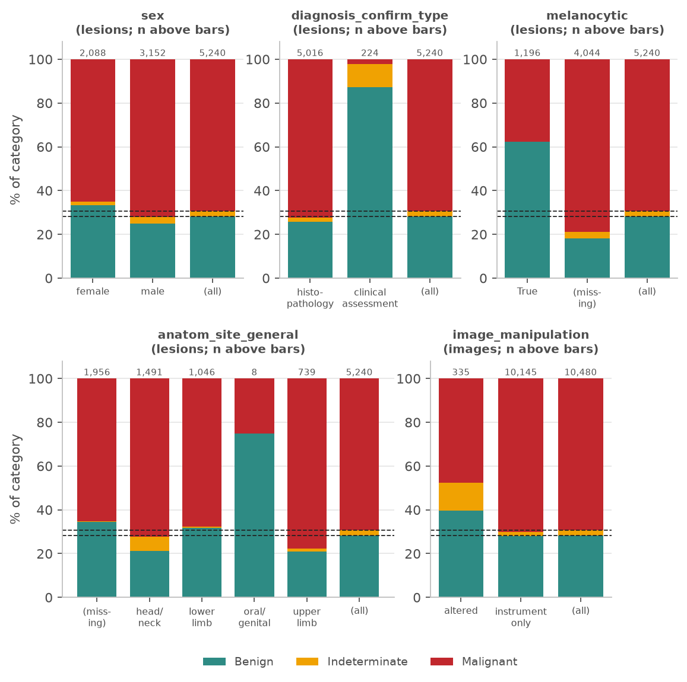
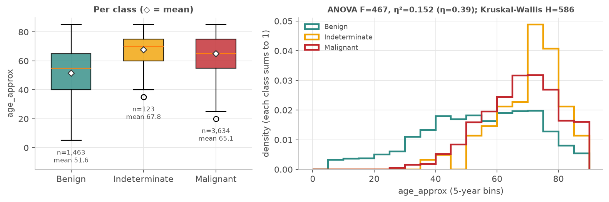
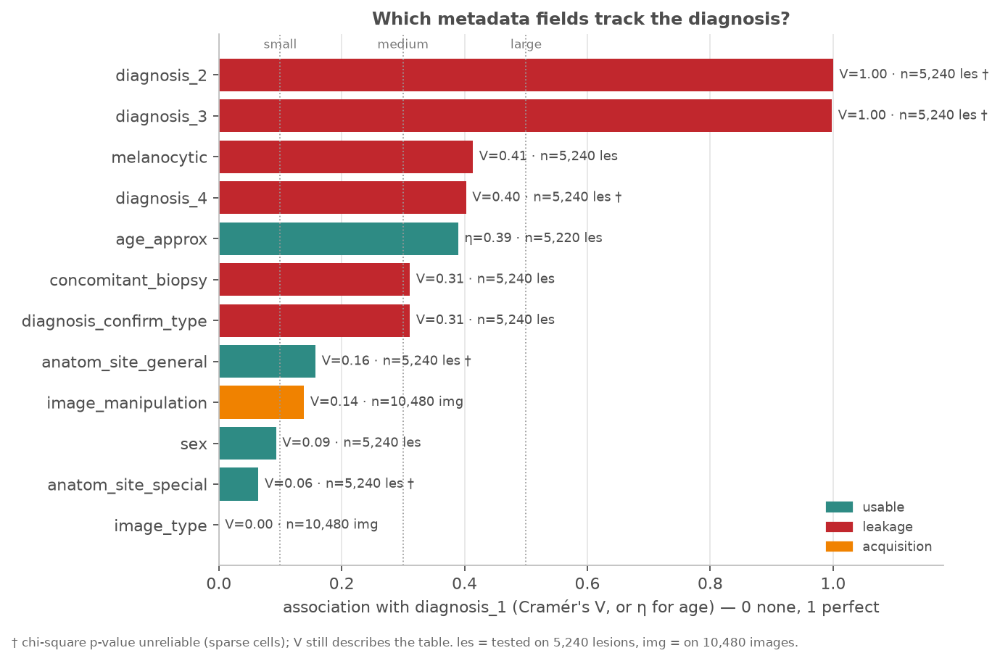
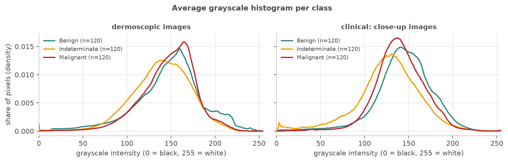
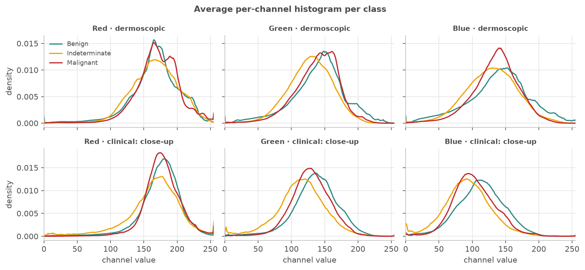
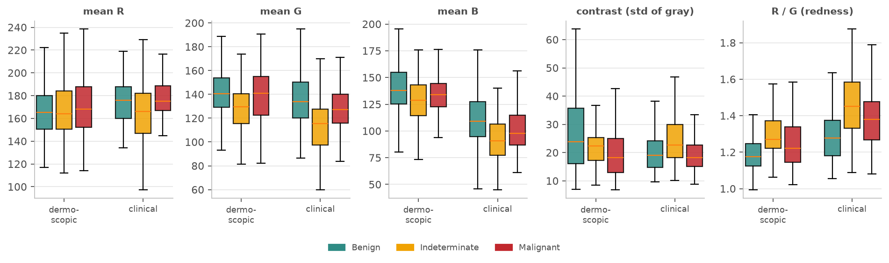
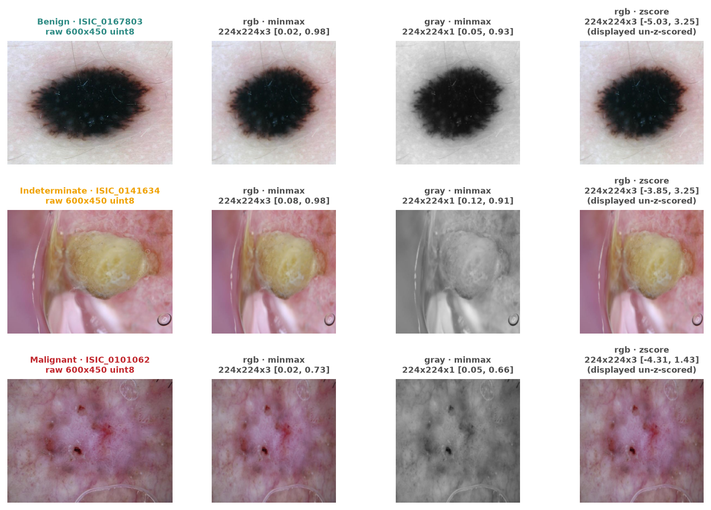
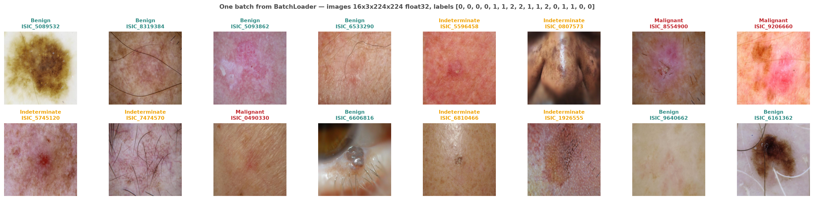
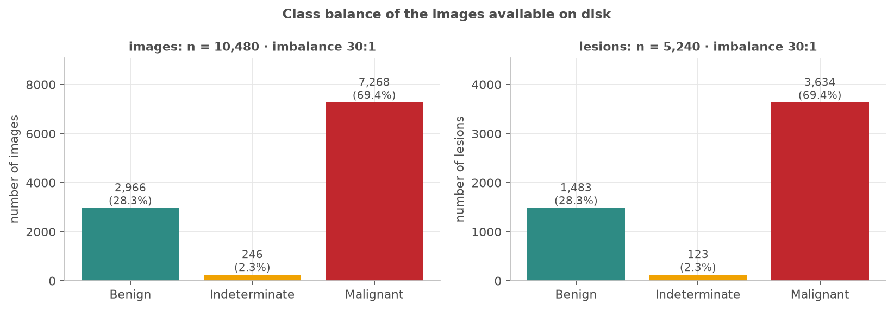
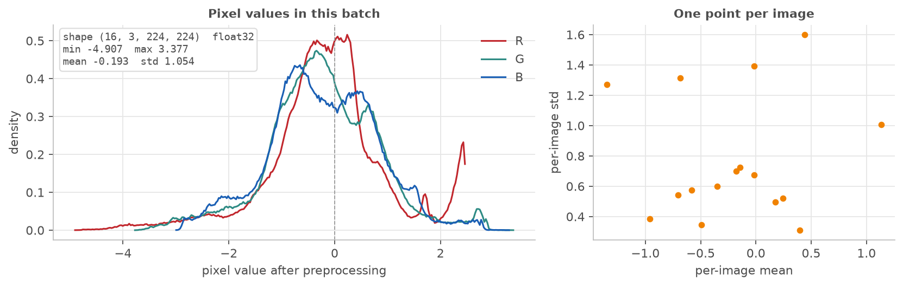

# Session 2 homework — Extended EDA & data pipeline (MILK10k)

**Stanislaus Lattorff** · Computer Vision & Speech Recognition, EADA · September 2026
**Code:** <https://github.com/stansilaisijfrnep/milk10k-computer-vision> — `src/milk10k/eda2.py` (Parts 1–2), `pipeline.py` (Parts 3–4), `viz.py` (Part 5). Running `python scripts/run_session2.py` recreates every figure and number in this report.

## Part 1 — Metadata analysis: correlation with the target

### 1. Columns, types and missing values

- `metadata.csv` has 17 columns: the id (`isic_id`), the target (`diagnosis_1`: Benign / Indeterminate / Malignant) and the **15 fields below**.
- Each lesion is photographed twice (dermoscopic + clinical), so the 10,480 rows are really **5,240 lesions**. From what I understood, testing on image rows would count every lesion twice, so I tested on lesions. The exceptions are `image_type` and `image_manipulation`, which differ between the two photos, so those I tested on images.

| Field | Type | Missing | Effect on diagnosis | My verdict |
|---|---|---|---|---|
| `diagnosis_2`, `diagnosis_3` | categorical (text labels) | 0 % / 1.5 % | V = 1.00 | leakage: more detailed versions of the label |
| `diagnosis_4` | categorical (text labels) | 85.5 % | V = 0.40 | leakage |
| `melanocytic` | boolean (only ever "True") | 77.2 % | V = 0.41 | leakage: only filled in for nevi and melanomas |
| **`age_approx`** | **numeric** (5-year bins) | 0.4 % | **η = 0.39** | **usable** |
| `diagnosis_confirm_type` | categorical (2 values) | 0 % | V = 0.31 | leakage: biopsy or not |
| `concomitant_biopsy` | boolean | 0 % | V = 0.31 | leakage: exactly the same as the row above |
| **`anatom_site_general`** | **categorical** (4 values) | 37.3 % | **V = 0.16** | **usable** |
| `image_manipulation` | categorical (2 values) | 0 % | V = 0.14 | acquisition / bias risk |
| `sex` | categorical (2 values) | 0 % | V = 0.09 | usable, but negligible |
| `anatom_site_special` | categorical (2 values) | 98.0 % | V = 0.06 | usable, but negligible |
| `image_type` | categorical (2 values) | 0 % | V = 0.00 | acquisition: every lesion has one of each |
| `attribution`, `copyright_license` | constant | 0 % | — | useless: one value for all rows |
| `lesion_id` | identifier | 0 % | — | only for grouping / splitting |

### 2. Categorical fields vs. the diagnosis



- The dashed lines show the overall class mix. A field is informative when its bars break away from them.
- **Informative:** `diagnosis_confirm_type` (non-biopsied lesions are 87 % benign, and only 5 of 224 are malignant), `melanocytic` (62 % benign when filled in vs. 18 % when missing) and `image_manipulation` (edited photos are 13 % Indeterminate vs. 2 % overall).
- **Somewhat informative:** body site. Head/neck holds most Indeterminate lesions; the other sites are close to the overall mix.
- **Roughly uniform:** `sex` (female 33 % benign vs. male 25 %; small difference).

### 3. Numeric field (age) vs. the diagnosis



- Benign lesions average **52 years**, malignant **65** and indeterminate **68**. Benign is also much more spread out.
- **Why ANOVA + η:** the target has 3 groups and age is a number, so I think the natural question is whether the average age differs between groups, which is what ANOVA tests. η² (0.15) says class explains 15 % of the age variance. η (0.39) is on the same 0–1 scale as Cramér's V, so I can rank age together with the categorical fields.
- Age comes in 5-year bins and is skewed, so I also ran **Kruskal–Wallis** (rank-based). It agrees (H = 586).
- For the categorical fields I used **chi-square + Cramér's V**, because V puts fields with 2 or 19 categories on the same scale.

### 4. Summary: most and least useful fields, leakage and bias



- With 5,240 lesions almost every p-value is ≈ 0, so I ranked by **effect size** instead of significance.
- **Most associated (usable):** 1) age, 2) body site. **Least useful:** sex, `anatom_site_special`, `image_type` and the constant columns.
- **Leakage I would never feed a model:**
  - `diagnosis_2/3/4`: they contain the answer.
  - `diagnosis_confirm_type` / `concomitant_biopsy`: from what I understood, a biopsy only happens when a doctor is already worried, so this tells the model what the doctor thought.
  - `melanocytic`: just knowing it is filled in gives away the lesion type.
- **Bias risk:** `image_manipulation` is about how the photo was made, not the skin, but it still shifts the classes. A model could learn "edited photo = indeterminate". Age and site are fine to use, but I would be careful the model doesn't just learn "old + face = malignant".

## Part 2 — Colour and histogram analysis across the dataset

### 5. Average histograms per class

- **Sample:** 120 lesions per class (Indeterminate only has 123) and both photos of each, so 720 images at full size. I went above the suggested 20–30 because all images are local, and 120 gives much smoother averages.
- I split dermoscopic and clinical photos because they look very different. Pooling them made the class differences smaller for every feature.





### 6. Colour statistics per image, per class



| Per image (mean ± sd) | Dermoscopic: Benign | Indet. | Malignant | Clinical: Benign | Indet. | Malignant |
|---|---|---|---|---|---|---|
| mean R | 167 ± 24 | 167 ± 27 | 171 ± 24 | 175 ± 20 | 164 ± 26 | 177 ± 19 |
| mean G | 141 ± 22 | 128 ± 20 | 139 ± 20 | 136 ± 23 | **114 ± 23** | 129 ± 20 |
| mean B | 139 ± 26 | 129 ± 25 | 135 ± 19 | 113 ± 25 | **93 ± 22** | 103 ± 23 |
| brightness (mean gray) | 148 ± 22 | 140 ± 22 | 148 ± 20 | 145 ± 21 | **127 ± 22** | 140 ± 19 |
| contrast (std gray) | 28 ± 15 | 23 ± 9 | 21 ± 11 | 21 ± 10 | 26 ± 12 | 19 ± 6 |
| redness (R / G) | 1.2 ± 0.1 | 1.3 ± 0.1 | 1.2 ± 0.1 | 1.3 ± 0.2 | **1.5 ± 0.2** | 1.4 ± 0.2 |

### 7. Do some classes look different, and why?

- **What I see:** Indeterminate images are darker and redder, mostly in the clinical photos. Benign dermoscopic images have more bright pixels and more contrast. Benign and Malignant look very similar in every channel.
- **But I don't think it's (only) the lesion.** In my sample, Indeterminate lesions are:
  - **80 % on the head/neck** (others 20–28 %),
  - **15 % very fair skin** (others ≤ 1 %),
  - **17.5 % edited photos** (others 2–5 %).
- That sounds like sun-damaged facial skin, photographed differently. 5 of the 120 Indeterminate clinical photos also have large dark backgrounds, which is where the spike at 0 in the histogram comes from.
- **Equipment / clinic:** I couldn't check this, because `attribution` is the same for every image.
- **Class imbalance:** not the cause here, since my sample is balanced (120 per class).

### 8. Could colour alone be a useful signal?

- **I don't think so.** No colour feature explains more than 15 % of its variance by class.
- A simple classifier on the 9 colour stats gets **0.47 balanced accuracy on dermoscopic** and **0.56 on clinical** photos, where chance is 0.33. That's better than guessing, but not useful, and it's best exactly where the site/skin bias is strongest.
- So the classes overlap a lot. I think the project needs a model that looks at **shapes and textures** (borders, patterns), i.e. a CNN, with age and site added carefully.

## Part 3 — Reusable image processing functions

### 9. One image: `process_image`

- Input: a file path, an `isic_id`, a PIL image or an array.
- Steps: resize (default 224×224) → colour space (RGB, gray, HSV or Lab) → normalise → optional channels-first.
- Returns the array **plus a record**: shape, dtype, value range and every step (e.g. *resize 600×450 → 224×224 → rgb → minmax → HWC→CHW*).
- **I chose min–max (x / 255) as the default.** It needs no statistics from the data, so nothing can leak between train and test, and it keeps brightness differences that per-image scaling would erase. Z-score is optional and uses the mean/std of the **training split only**.

### 10. Many images: `process_batch`

- Takes a list of paths/ids or a metadata DataFrame, and applies exactly the same settings to each image.
- Returns a stacked array, or a list if the sizes differ.
- **One bad file doesn't crash it:** the file is skipped and reported as `(id, reason)`. I tested this with a cut-off JPEG, a text file and a missing id.

### 11. Test on real images (raw vs. processed)



- Each row is one real image (one per class): raw 600×450, then RGB min–max, grayscale and z-score. Each title shows the resulting shape and value range.

## Part 4 — Data loader

### 12. `BatchLoader`

- Yields batches of (processed images, labels), with a configurable batch size.
- Images are loaded and processed **batch by batch** with `process_batch`, never all at once.
- Labels are numbers (0 = Benign, 1 = Indeterminate, 2 = Malignant), with the names kept alongside. Shuffling is optional and reproducible via a seed.

### 13. Only images that exist on disk

- It reads the image folder **once** and keeps only rows with a matching file. `loader.n_missing` says how many rows were dropped.
- On my machine all 10,480 images are present, so nothing is dropped, but a test checks that a fake row does get dropped.

### 14. Interface

```text
BatchLoader(metadata, img_dir=None, *, batch_size=32, label_col="diagnosis_1",
            classes=("Benign","Indeterminate","Malignant"), shuffle=False, seed=42,
            drop_last=False, channels_first=True, **process_image options)
len(loader)        -> batches per epoch        loader.n_missing / .missing_ids -> rows with no file on disk
for batch in loader:
    batch.images       # float32 (B, 3, 224, 224)       batch.labels      # int64 (B,) class numbers
    batch.label_names  # ["Malignant", ...]             batch.ids         # isic_id per image
    batch.skipped      # [(isic_id, reason), ...] for files that failed
```

## Part 5 — Data visualizer

### 15. Image grid with labels



- `show_image_grid` / `show_batch` take a list of arrays **or** a batch straight from the loader. Above is a real batch.
- It undoes the normalisation and reorders channels before plotting; otherwise loader output would look wrong.

### 16. Class balance



- **The data is very imbalanced:** 69 % Malignant, 28 % Benign and only 2.3 % Indeterminate (30:1).
- A model that always says "Malignant" would already be 69 % accurate. So I think later I'll need class weights or a weighted sampler, and should judge the model by balanced accuracy / per-class recall, not plain accuracy.

### 17. Batch summary for debugging



- It shows the pixel values of one batch per channel, plus mean vs. std per image.
- It confirms z-scoring worked (mean −0.19, std 1.05). It also showed red pixels maxing out at 255, which I didn't expect.

## Design choices (Parts 3–5)

Each piece builds on the one before instead of copying code: `process_image` → `process_batch` → `BatchLoader` → the `viz` functions. `process_image` reuses the project's existing resize function, and a test checks that the output is identical, so analysis and training can't end up preprocessing images differently. `process_batch` only adds the error handling, the loader only adds file checking, labels, shuffling and batching, and every visualiser accepts exactly what the loader gives back. Every option has a default and every result says what was done to it, so in later milestones I can just call these functions without re-reading the code.
